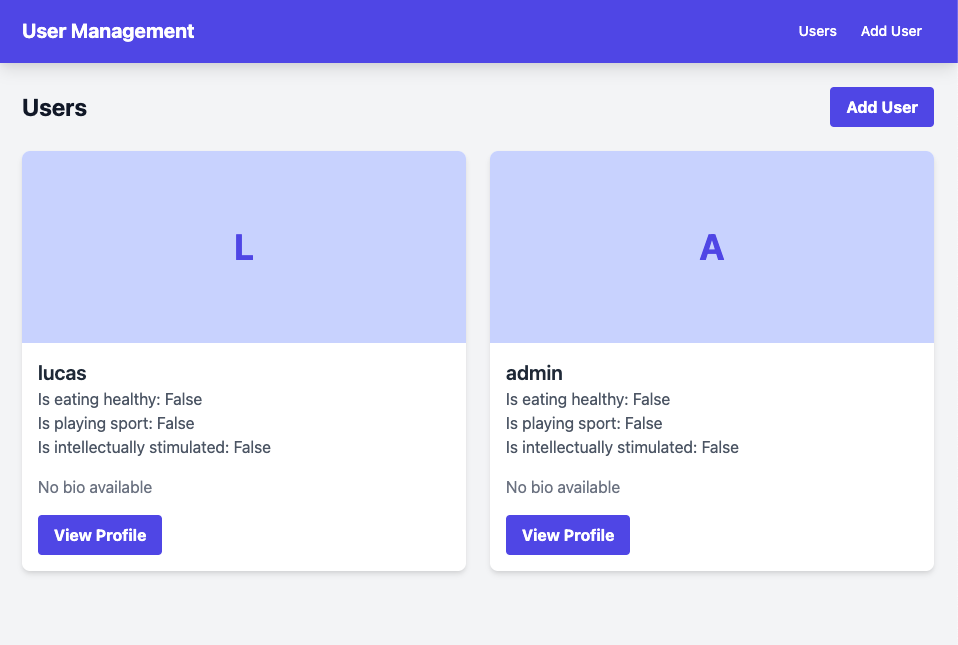
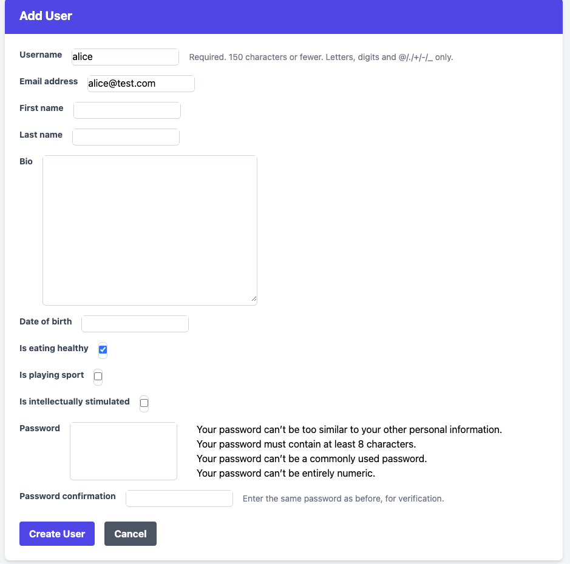
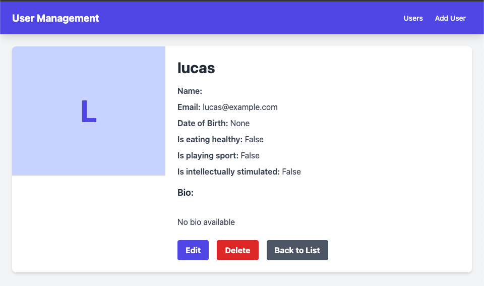
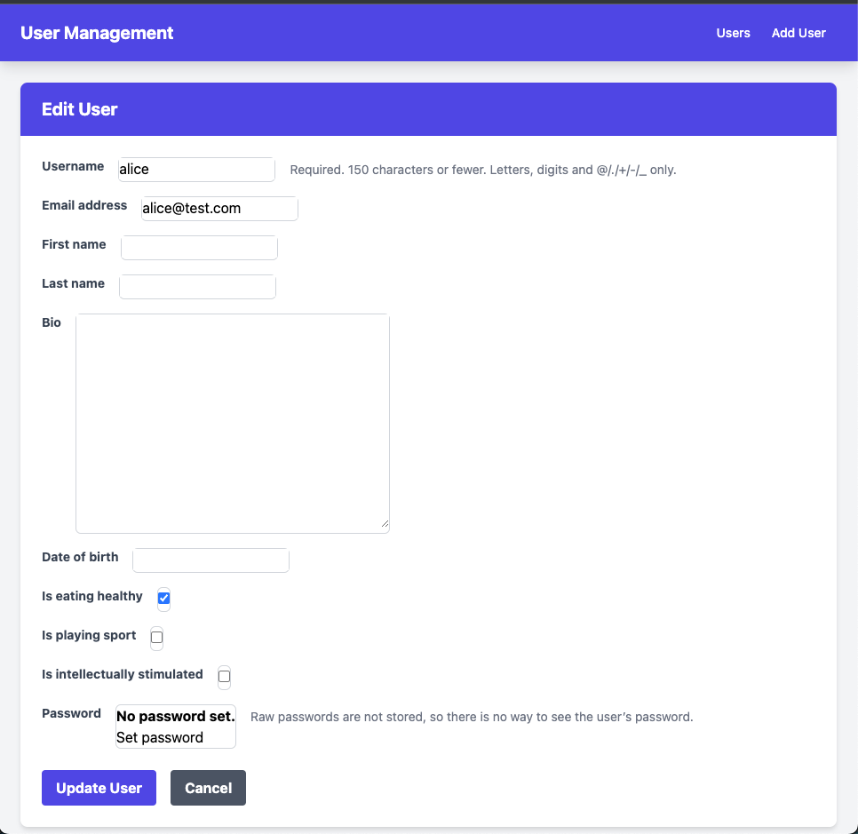
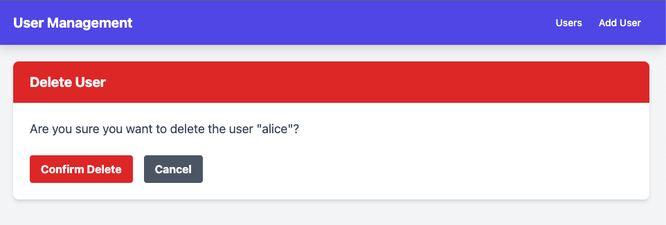
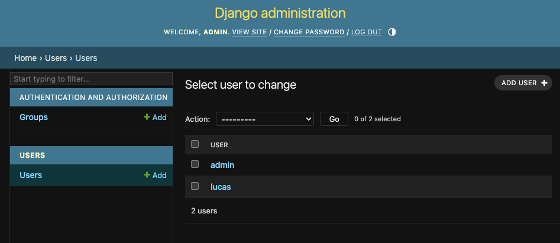

# Django CRUD USER

A Django application demonstrating user management operations (Create, Read, Update, Delete) with Tailwind UI.

## Prerequisites

-  Python 3.12+
-  Django 5.0+
-  pip (Python package manager)
-  Virtual environment tool (recommended)

## Installation

1. Create and activate a virtual environment:

   ```
   python -m venv venv
   source venv/bin/activate
   ```

2. Install dependencies:

   ```
   pip install -r requirements.txt
   ```

3. Configure environment variables:

   -  Create a `.env` file based on `env.example`

4. Apply migrations:

   ```
   python manage.py migrate
   ```

5. Create a superuser:

   ```
   python manage.py createsuperuser
   ```

6. Run the development server:

   ```
   python manage.py runserver
   ```

7. Access the application at http://127.0.0.1:8000/

## User Management Operations

You can manage users via the Python shell or through the web interface.

### Using Python Shell

```python
python manage.py shell

from users.models import CustomUser

# Create a new user
CustomUser.objects.create(
    email='lucas@example.com',
    username='lucas',
    is_eating_healthy=False,
    is_playing_sport=False,
    is_intellectually_stimulated=False
)

# View all users
CustomUser.objects.all()
```

### Web Interface

#### List View

View all registered users in the system.


#### Create

Register new users with username, email, password, and other User model from https://docs.djangoproject.com/en/5.1/ref/contrib/auth/
And custom filed : is_eating_healthy, is_playing_sport, is_intellectually_stimulated, bio.


#### Read

View detailed user profiles.


#### Update

Modify user profile information.


#### Delete

Remove user accounts from the system.


## Django Administration

Access the built-in Django admin interface for advanced user management.


## Future Improvements

-  Consider using a custom user model instead of extending `django.contrib.auth` to simplify the user model
-  Implement endpoint protection with authentication and permission checks
-  Apply Tailwind CSS classes directly in Django forms using widgets:

```python
widgets = {
    'username': forms.TextInput(attrs={
        'class': 'border border-gray-300 rounded-md px-3 py-2 w-full focus:outline-none focus:ring-2 focus:ring-indigo-500 focus:border-indigo-500'
    }),
    # Add similar styling for other fields
}
```
